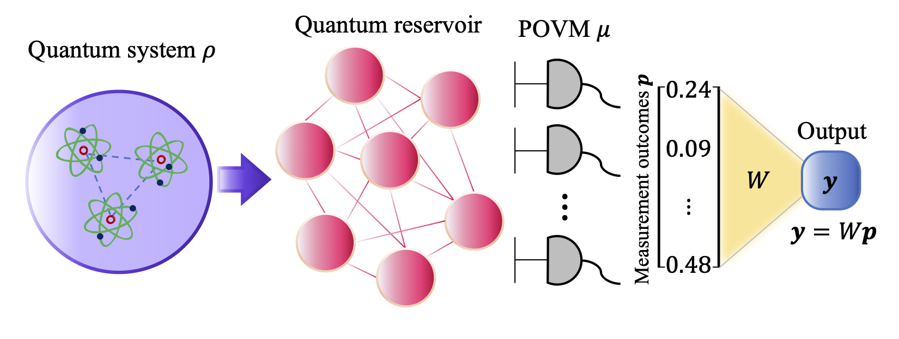

<html lang="en">
        <body>
          
This Course is hosted at the

          <h2> 
          
ETTORE MAJORANA FOUNDATION
          AND CENTRE FOR SCIENTIFIC CULTURE
</h2>
          
DIRECTOR: A. ZICHICHI

          

          
as part of the

          <h1> 
          
INTERNATIONAL SCHOOL ON NONEQUILIBRIUM PHENOMENA

          </h1>
          
Directors of the School: A. Lanzara, G. M. Palma, B. Spagnolo

          <h2>
          
Working Party on Quantum Reservoir Computing (QRC2024)

          <!-- -->
          </h2>
          
Directors of the Course: S. Lorenzo, G. M. Palma, M. Paternostro

          

          
Dates: 14 - 18 October 2024

          <!--  -->
          

          Scopes: The aim of the course is to discuss the current understanding of quantum reservoir computing, (QRC) to develop characterization tools for quantum computation and process identification. The features of the specific platforms currently being explored for these goals will be considered, as well as the impact of noise and thermodynamic constraints. The working party will discuss the range of tasks that can be efficiently solved by QRC and, notably, the combination of analytical and numerical approaches, including the exploitation of quantum simulation on quantum-computer platforms.
          

          

          <a class="lead" href="../../">Back</a>
 
        </body>
        </html> 