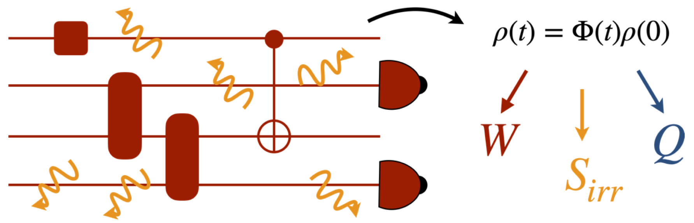

<html lang="en">
        <body>
          <!--  -->
          

          The ultimate limit to heat generation by computers – a key issue for developing new information
          technology devices - must be evaluated from a thermodynamics of computation standpoint. A
          lower bound is set by the Landauer limit, at which computation becomes thermodynamically
          reversible. Classically, nothing prevents such limit being reached and approaches to it are being
          tested. In the quantum domain, the Landauer limit needs a reformulation that considers the non-
          equilibrium nature of quantum dynamics and the excess heat generated by quantum maps and
          measurements, which make quantum computing thermodynamically irreversible.
          

           ASpEQCt will
          explore the thermodynamics of quantum computation to establish its energetic cost. The project,
          which puts together experts in quantum thermodynamics, quantum computing and open-system
          dynamics, will shed light on the thermodynamic resources that have to be consumed to perform
          computational tasks – including in the measurement-based quantum computing framework – and
          to control a logical register. It will be key to evaluate the usefulness of quantum resources, both
          states and operations, paving the way to the provision of the energetic footprint of quantum
          devices. Ultimately, ASpEQCt will contribute to the resolution of sustainability-related limitations
          in the current paradigms of quantum technologies.
        </body>
        </html> 