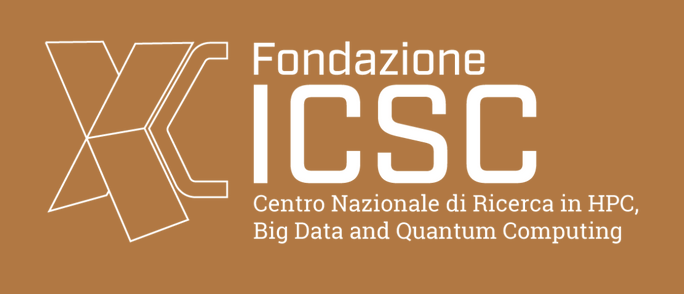

<html lang="en">
        <body>
          <!--  -->
          

          The objective of HYQELM is to develop hybrid quantum algorithms for implementation on Quantum Extreme Learning Machines (QELM), leveraging their fault tolerance for use in the Noisy, Intermediate-Scale Quantum (NISQ) regime. 
          Our research will focus on developing hybrid quantum/classical algorithms to address classification problems, with classical input used for tasks such as calculating molecular configuration energy and classifying astrophysical features, 
          while quantum input will be utilized for tasks like entanglement          witness reconstruction and quantum state tomography. This research          has vast potential applications in both fundamental research and        commercial domains. Our team, 
          comprising experts in quantum information theory, quantum machine learning, computational biophysics, chemistry, and astrophysics, will adopt an interdisciplinary approach to identify the most suitable methods and techniques for 
          each application.
          

           
        </body>
        </html> 