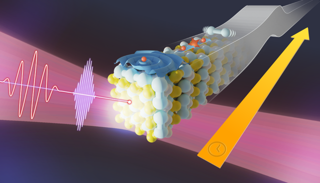

<html lang="en">
        <body>
          <!--  -->
          

          The interplay of correlated, and coherent behavior in electrons, spins, photons, and nuclei within materials holds the key to unlocking a new era of quantum technologies. By delving into the ultrafast dynamics of these systems under non-equilibrium conditions, we can pave the way for breakthroughs in quantum computing, information storage, energy-efficient light-emitting devices, and single-photon sources.
          The TIMES doctoral network aims to achieve a novel paradigm for simulating non-equilibrium processes at the atomic level within condensed matter. This field currently struggles with limited predictive power. Current approaches, whether based on first-principles or more phenomenological ones, lack the necessary detail to capture the intricate evolution of complex materials.
          

           The TIMES network will address this challenge by developingtheoretical and computational tools. These tools will focus on the coherent and correlated dynamics between electrons and nuclei, triggered by ultrafast laser pulses. This will provide a deeper understanding of complex quantum states and the emergence of novel phenomena in a wide range of functional materials, including perovskites, two-dimensional materials, Weyl semimetals, Dirac materials, and topological insulators. To achieve this ambitious goal, TIMES will train a new generation of scientists equipped to design innovative theoretical and computational frameworks for simulating non-equilibrium phenomena. This network will foster synergy between theoretical and computational advancements, collaborating with High Performance Computing Centers, Small and Medium Enterprises (SMEs), and big data facilities across Europe. TIMES will establish strong connections with leading experimental groups specializing in ultrafast spectroscopy. This collaborative effort will be instrumental in propelling our understanding and development of advanced quantum materials.
        </body>
        </html> 