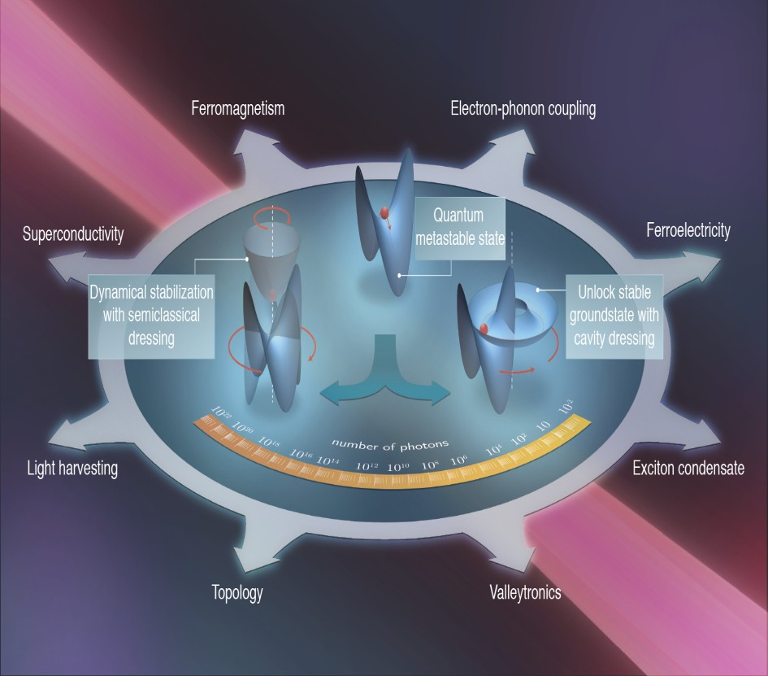

---
title: '#### Quantum   Materials {style="text-align: center;"}'
date: none
type: landing
tags:
  - mater
# Your landing page sections - add as many different content blocks as you like

sections:
  - block: markdown
    id: mater-1
    content:
      title: '## Quantum Materials'
      subtitle: "[ Back   ](../../research_lines)"
      text: |
        <html lang="en">
        <body>
          
          

          This research line in quantum materials focuses on the interaction between these materials and light, whether in the form of quantized photons in cavity quantum electrodynamics (QED) setups or classical laser fields. We explore how light can be used to manipulate and control the electronic, magnetic, and optical properties of quantum materials, leading to fascinating phenomena and potential technological applications.
 
          By leveraging the unique properties of quantum materials and the tunability of light, we aim to develop novel functionalities such as ultrafast control of quantum states, generation of exotic phases of matter, and realization of novel quantum devices for information processing and sensing. 

          This interdisciplinary field combines concepts from condensed matter physics, quantum optics, and materials science, offering exciting opportunities for fundamental discoveries and technological innovation.
        </body>
        </html>  
    design:
      columns: 1
  - block: markdown
    id: button
    content:
      title: 
      subtitle: 
      text: |
        

        <a class="lead" href="../../research_lines/">Back</a>

    design:
      columns: 1
---