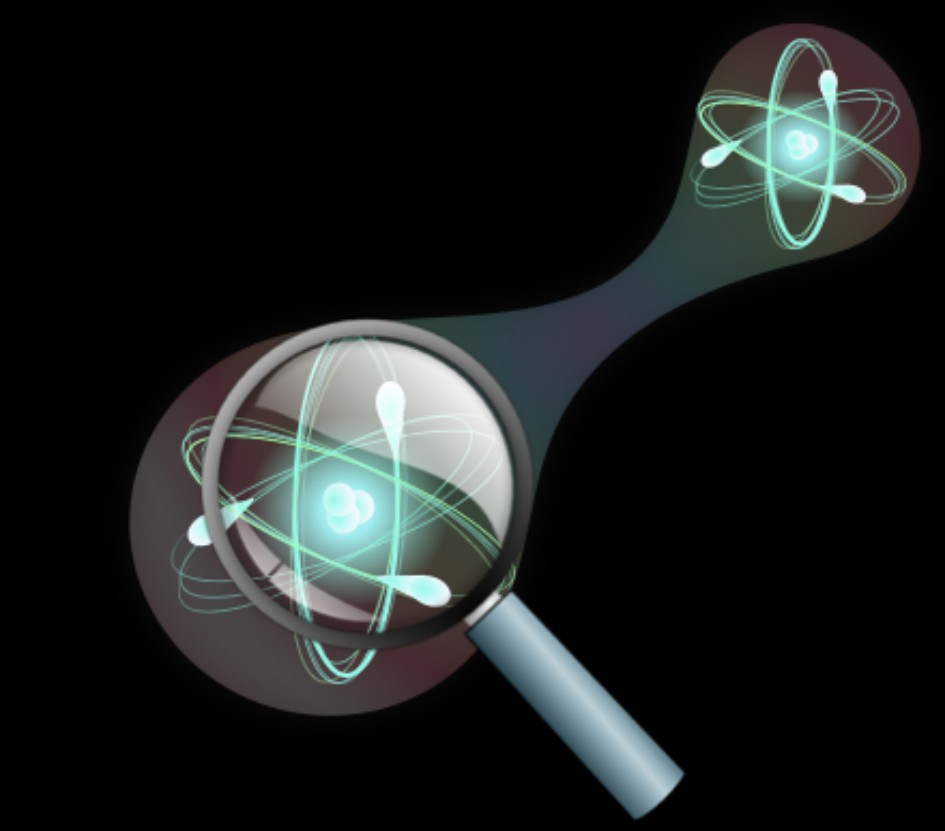

---
title: '#### Quantum   Metrology {style="text-align: center;"}'
date: none
type: landing
tags:
  - metro
# Your landing page sections - add as many different content blocks as you like

sections:
  - block: myhero
    content:
      title: Quantum Metrology
      image:
        # Reference an image in your `assets/media/` folder
        filename: metrology.jpg
      # Add your Hero text here
      cta_note:
        label: >-
          
<a class="github-button" href="../../research_lines" data-icon="octicon-star"   data-size="large" data-show-count="true" aria-label="Star">Back</a>

      # Add your Hero text here
      text: |-
           
          Metrology is the cornerstone of science which investigates the accuracy by which any given physical quantitiy can be  measured. Using the principle of quantum mechanics it is possible to increase such accuracy far beyond what is possible with   classical systems. 

          Quantum metrology is the science that investigates how this is possible and how to harness quantum mechanical effects, such   as entanglement, quantum squeezing and critical quantum systems, to gain an edge over purely classical approaches.
 This  finds applications in a wide variety of fields, from fundamental physics, to gravitational wave detection, communication,  navigation, thermometry, imaging, remote sensing, to name a few. 
    design:
      # Choose an optional background color, gradient, image, or video
      background:
        gradient_end: '#FFFFFF'
        gradient_start: '#FFFFFF'
        text_color_light: false
  #- block: markdown
  #  id: metro-1
  #  content:
  #    title: '## Quantum Metrology'
  #    subtitle: "[ Back   ](../../research_lines)"
  #    text: |
  #      <html lang="en">
  #      <body>
  #        
  #        

  #        Metrology is the cornerstone of science which investigates the accuracy by which any given physical quantitiy can be #measured. Using the principle of quantum mechanics it is possible to increase such accuracy far beyond what is possible with #classical systems. 

  #        Quantum metrology is the science that investigates how this is possible and how to harness quantum mechanical effects, such #as entanglement, quantum squeezing and critical quantum systems, to gain an edge over purely classical approaches.
 This #finds applications in a wide variety of fields, from fundamental physics, to gravitational wave detection, communication, #navigation, thermometry, imaging, remote sensing, to name a few.
  #      </body>
  #      </html>  
  #  design:
  #    columns: 1
  #- block: markdown
  #  id: button
  #  content:
  #    title: 
  #    subtitle: 
  #    text: |
  #      

  #      <a class="lead" href="../../research_lines/">Back</a>

  #  design:
  #    columns: 1
---