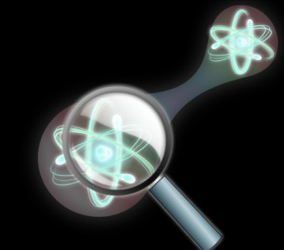

---
title: '#### Quantum   Machine Learning {style="text-align: center;"}'
date: none
type: landing
tags:
  - QML
# Your landing page sections - add as many different content blocks as you like

sections:
  - block: myhero
    content:
      title: Quantum Machine learning
      image:
        # Reference an image in your `assets/media/` folder
        filename: qml.png
      # Add your Hero text here
      cta_note:
        label: >-
          
<a class="github-button" href="../../research_lines" data-icon="octicon-star"   data-size="large" data-show-count="true" aria-label="Star">Back</a>

      # Add your Hero text here
      text: |-
           
          Quantum Information Theory explores the intersection of quantum mechanics and information theory.

          At its core are qubits, quantum counterparts to classical bits, which can exist in superpositions and entangled states. Superposition enables parallel computations, while entanglement provides unique correlations between particles. Quantum gates manipulate qubits, forming the basis for quantum computing and algorithms. 

          This interdisciplinary field encompasses quantum cryptography, communication, and sensing. Challenges include mitigating decoherence, implementing error correction, and bridging theoretical concepts with practical applications. Quantum Information Theory promises revolutionary advancements in computation, communication security, and precision measurement.
    design:
      # Choose an optional background color, gradient, image, or video
      background:
        gradient_end: '#FFFFFF'
        gradient_start: '#FFFFFF'
        text_color_light: false
  #- block: markdown
  #  id: qinfo-1
  #  content:
  #    title: '## Quantum Information'
  #    subtitle: "[ Back   ](../../research_lines)"
  #    text: |
  #      <html lang="en">
  #      <body>
  #        
  #        
Quantum Information Theory explores the intersection of quantum mechanics and information theory. At its core are qubits, #quantum counterparts to classical bits, which can exist in superpositions and entangled states. Superposition enables #parallel computations, while entanglement provides unique correlations between particles. Quantum gates manipulate qubits, #forming the basis for quantum computing and algorithms. 

  #        This interdisciplinary field encompasses quantum cryptography, communication, and sensing. Challenges include mitigating #decoherence, implementing error correction, and bridging theoretical concepts with practical applications. Quantum #Information Theory promises revolutionary advancements in computation, communication security, and precision measurement.
  #  design:
  #    columns: 2
  #- block: markdown
  #  id: button
  #  content:
  #    title: 
  #    subtitle: 
  #    text: |
  #      

  #      <a class="lead" href="../../research_lines/">Back</a>

  #  design:
  #    columns: 1
---