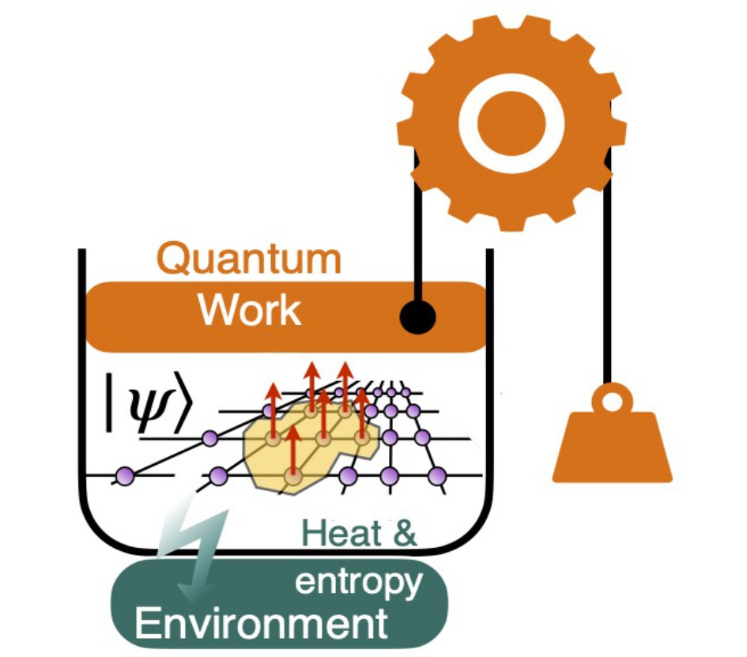

---
title: '#### Quantum Thermodynamics {style="text-align: center;"}'
date: none
type: landing
tags:
  - QT
# Your landing page sections - add as many different content blocks as you like

sections:
  - block: markdown
    id: QT
    content:
      title: '## Quantum Thermodynamics'
      subtitle: "[ Back   ](../../research_lines)"
      text: |
        <html lang="en">
        <body>
          
          

          Quantum thermodynamics marries the well-established laws of thermodynamics, which describe heat and work, with the powerful, yet different, framework of quantum mechanics. Thermodynamics thrives on describing large systems with average properties. Quantum mechanics, on the other hand, excels at depicting the probabilistic nature of individual particles. The thermodynamics of quantum systems and processes seeks to reconcile these seemingly disparate approaches. This understanding is vital for building quantum technologies: By uncovering how quantum systems exchange heat and perform work, we can design machines that harness the unique properties of quantum mechanics, such as quantum superposition. This could lead to breakthroughs in energy production, information processing, and even reshape our understanding of the universe's fundamental building blocks.

          Qunipa is leading the efforts in the construction of a self-consistent theoretical framework for the understanding and characterisation of the thermodynamic implications of quantum dynamics, all the way to quantum computing and quantum control processes. We often collaborate with experimentalists working in controlled quantum systems to put our tools and theory in place and test the energetics of forefront experimental platforms.

        </body>
        </html>  

    design:
      columns: 2
  - block: markdown
    id: button
    content:
      title: 
      subtitle: 
      text: |
        

        <a class="lead" href="../../research_lines/">Back</a>

    design:
      columns: 1
---