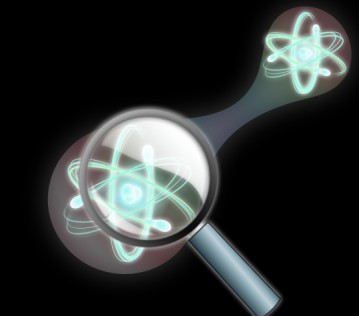
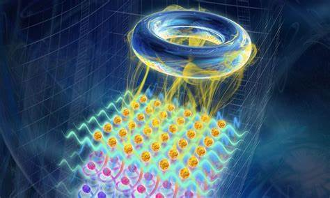

---
title: '#### Quantum Topology {style="text-align: center;"}'
date: none
type: landing
tags:
  - topo
# Your landing page sections - add as many different content blocks as you like

sections:
  - block: markdown
    id: topo-1
    content:
      title: '## Quantum Topology'
      subtitle: "[ Back   ](../../research_lines)"
      text:  <html lang="en">
        <body>
          
          

          Quantum Your text goes here.Lorem ipsum dolor sit amet, consectetur adipiscing elit, sed do eiusmod tempor incididunt ut# labore et dolore magna aliqua. Ut enim ad minim veniam, quis nostrud exercitation ullamco# laboris nisi ut aliquip ex ea commodo consequat. Your text goes here.Lorem ipsum dolor sit amet, consectetur adipiscing elit, sed do eiusmod tempor incididunt ut# labore et dolore magna aliqua. Ut enim ad minim veniam, quis nostrud exercitation ullamco# laboris nisi ut aliquip ex ea commodo consequat. 
          

           Your text goes here.Lorem ipsum dolor sit amet, consectetur adipiscing elit, sed do eiusmod tempor incididunt ut# labore et dolore magna aliqua. Ut enim ad minim veniam, quis nostrud exercitation ullamco# laboris nisi ut aliquip ex ea commodo consequat. Your text goes here.Lorem ipsum dolor sit amet, consectetur adipiscing elit, sed do eiusmod tempor incididunt ut# labore et dolore magna aliqua. Ut enim ad minim veniam, quis nostrud exercitation ullamco# laboris nisi ut aliquip ex ea commodo consequat
        </body>
        </html> 
    design:
      columns: 2
      
  - block: markdown
    id: topo-2
    content:
      title: Section 2
      subtitle: A subtitle
      text: <html lang="en">
        <body>
          
          

          Quantum Your text goes here.Lorem ipsum dolor sit amet, consectetur adipiscing elit, sed do eiusmod tempor incididunt ut# labore et dolore magna aliqua. Ut enim ad minim veniam, quis nostrud exercitation ullamco# laboris nisi ut aliquip ex ea commodo consequat. Your text goes here.Lorem ipsum dolor sit amet, consectetur adipiscing elit, sed do eiusmod tempor incididunt ut# labore et dolore magna aliqua. Ut enim ad minim veniam, quis nostrud exercitation ullamco# laboris nisi ut aliquip ex ea commodo consequat. 
          

           Your text goes here.Lorem ipsum dolor sit amet, consectetur adipiscing elit, sed do eiusmod tempor incididunt ut# labore et dolore magna aliqua. Ut enim ad minim veniam, quis nostrud exercitation ullamco# laboris nisi ut aliquip ex ea commodo consequat. Your text goes here.Lorem ipsum dolor sit amet, consectetur adipiscing elit, sed do eiusmod tempor incididunt ut# labore et dolore magna aliqua. Ut enim ad minim veniam, quis nostrud exercitation ullamco# laboris nisi ut aliquip ex ea commodo consequat
        </body>
        </html> 
    design:
      columns: 1
  - block: markdown
    id: button
    content:
      title: 
      subtitle: 
      text: |
        

        <a class="lead" href="../../research_lines/">Back</a>

    design:
      columns: 1
---